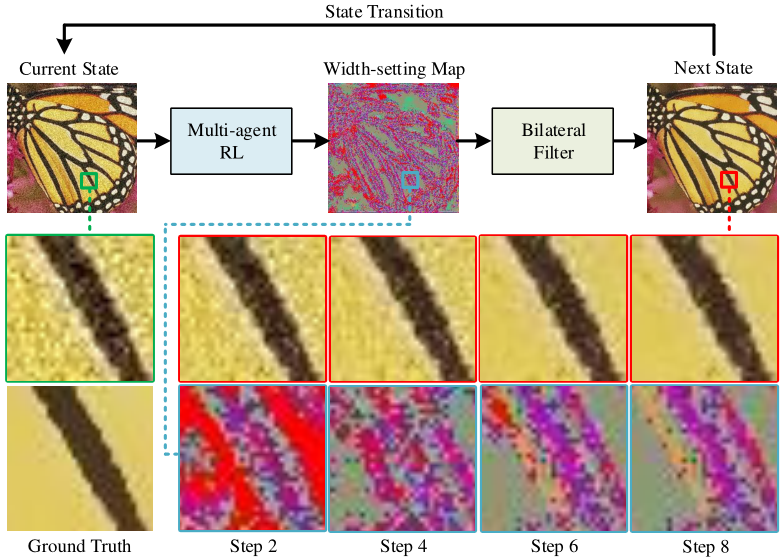

# ADAPTIVE ACTOR-CRITIC BILATERAL FILTER

[](https://creativecommons.org/licenses/by-nc-sa/4.0/)
[](https://hits.seeyoufarm.com)



## Introduction
Recent research on edge-preserving image smoothing has suggested that bilateral filtering is vulnerable to maliciously perturbed filtering input. However, while most prior works analyze the adaptation of the range kernel in one-step manner, in this paper we take a more constructive view towards multi-step framework with the goal of unveiling the vulnerability of bilateral filtering. To this end, we adaptively model the width setting of range kernel as a multi-agent reinforcement learning problem and learn an adaptive actor-critic bilateral filter from local image context during successive bilateral filtering operations. By evaluating on eight benchmark datasets, we show that the performance of our filter outperforms that of state-of-the-art bilateral-filtering methods in terms of both salient structures preservation and insignificant textures and perturbation elimination.

**Authors**: Bo-Hao Chen, Hsiang-Yin Cheng, and Jia-Li Yin

**Paper**: [PDF](https://ieeexplore.ieee.org/document/9746631)

## Requirements
### Dependencies
* Python 3.5+
* Chainer 5.0.0
* ChainerRL 0.5.0
* Cupy 5.0.0
* OpenCV 3.4.3.18
* Numpy 1.16.1
* Scipy 1.0.0
* matplotlib 3.5.2
* sewar 0.4.5

### Model
* Pre-trained models can be downloaded from [google drive](https://drive.google.com/drive/folders/1iqkGTl8sqoVEaVFo4uoAJiLFtce_f8cu?usp=sharing) or [baidu drive](https://pan.baidu.com/s/1nLrWmgkYNffSJHB1Fsr0Gw) (password: 2wrw).

### It was tested and runs under the following OSs:
* Windows 10 with GeForce GTX 1060 GPU
* Ubuntu 16.04 with NVIDIA GTX 1080 Ti GPU

## Preparing Data
1. To build training dataset, you'll also need following datasets. All the images needs to be cropped into a square, and resize to **256*256**.
* [DIV2K](http://data.vision.ee.ethz.ch/cvl/DIV2K/DIV2K_train_HR.zip)

2. Run the following script to generate **noise image**, and results will be saved in: `./trainsets/DIV2K/`.
```bash
$ git clone https://github.com/bigmms/chen_grsl21_tpbf.git
$ cd chen_grsl21_tpbf
$ matlab
>> demo_noise
```

3. Run the following script to generate **ground truth image**, and results will be saved in: `./data/img_gt/`.
```bash
>> demo_BF
```

4. Structure of the generated data should be：
```
├── data
    ├──img_gt             #folder for storing ground truth images
    │  ├── 0001.png                
    │  ├── 0002.png 
    │  └── ...
    ├──img_noise          #folder for storing noise images
    │  ├── 0001.png
    │  ├── 0002.png
    │  └── ... 
    └──img_ori            #folder for storing original images
       ├── 0001.png
       ├── 0002.png
       └── ...
```

## Getting Started
```bash
>> demo_TPBF
```
The test results will be saved in: `./img_output/`

## Results


## License + Attribution
The TPBF code is licensed under [CC BY-NC-SA 4.0](https://creativecommons.org/licenses/by-nc-sa/4.0/). Commercial usage is not permitted. If you use this code in a scientific publication, please cite the following [paper](https://ieeexplore.ieee.org/document/9325516):
```
@ARTICLE{ChenGRSL2021,  
	author={Chen, Bo-Hao and Cheng, Hsiang-Yin and Tseng, Yi-Syuan and Yin, Jia-Li}, 
	journal={IEEE Geoscience and Remote Sensing Letters},   
	title={Two-Pass Bilateral Smooth Filtering for Remote Sensing Imagery},   
	year={2022},  
	volume={19},  
	number={},  
	pages={1-5},  
	doi={10.1109/LGRS.2020.3048488}}
```
