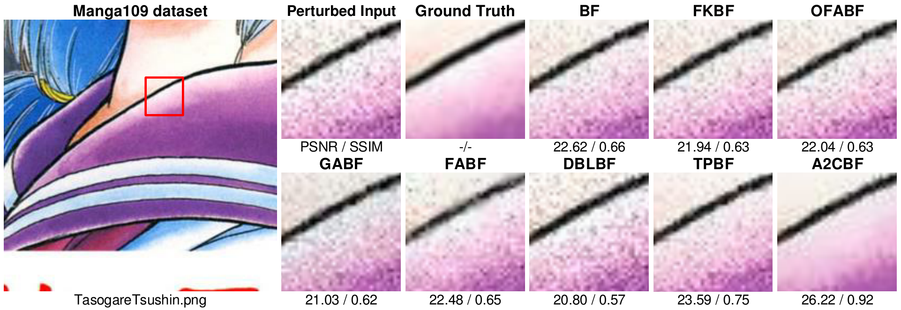

# ADAPTIVE ACTOR-CRITIC BILATERAL FILTER

[](https://creativecommons.org/licenses/by-nc-sa/4.0/)
[](https://hits.seeyoufarm.com)


## Introduction
Recent research on edge-preserving image smoothing has suggested that bilateral filtering is vulnerable to maliciously perturbed filtering input. However, while most prior works analyze the adaptation of the range kernel in one-step manner, in this paper we take a more constructive view towards multi-step framework with the goal of unveiling the vulnerability of bilateral filtering. To this end, we adaptively model the width setting of range kernel as a multi-agent reinforcement learning problem and learn an adaptive actor-critic bilateral filter from local image context during successive bilateral filtering operations. By evaluating on eight benchmark datasets, we show that the performance of our filter outperforms that of state-of-the-art bilateral-filtering methods in terms of both salient structures preservation and insignificant textures and perturbation elimination.

**Authors**: Bo-Hao Chen, Hsiang-Yin Cheng, and Jia-Li Yin

**Paper**: [PDF](https://ieeexplore.ieee.org/document/9746631)

## Requirements
### Dependencies
* Python 3.5+
* Chainer 5.0.0
* ChainerRL 0.5.0
* Cupy 5.0.0
* OpenCV 3.4.3.18
* Numpy 1.16.1
* Scipy 1.0.0
* matplotlib 3.5.2
* sewar 0.4.5
* MATLAB R2019a
* MATLAB R2017b

<!-- ### Model
* Pre-trained models can be downloaded from [google drive](https://drive.google.com/drive/folders/1iqkGTl8sqoVEaVFo4uoAJiLFtce_f8cu?usp=sharing) or [baidu drive](https://pan.baidu.com/s/1nLrWmgkYNffSJHB1Fsr0Gw) (password: 2wrw). -->

### It was tested and runs under the following OSs:
* Windows 10 with GeForce GTX 2080 GPU
* Ubuntu 16.04 with NVIDIA TITAN GPU

<!-- https://github.com/ChaofWang/Awesome-Super-Resolution/blob/master/dataset.md -->
## Preparing Data
1. To build **training** dataset, you'll also need following datasets. All the images needs to be cropped into a square, resize to **256*256**, and convert to **gray scale**.
* [DIV2K](http://data.vision.ee.ethz.ch/cvl/DIV2K/DIV2K_train_HR.zip)

2. To build **validation/testing** dataset, you'll also need following datasets. All the images needs to be cropped into a square, resize to **256*256**.
* [Set5](https://uofi.box.com/shared/static/kfahv87nfe8ax910l85dksyl2q212voc.zip)
* [Set14](https://uofi.box.com/shared/static/igsnfieh4lz68l926l8xbklwsnnk8we9.zip)
* [BSDS100](https://uofi.box.com/shared/static/qgctsplb8txrksm9to9x01zfa4m61ngq.zip)
* [Urban100](https://uofi.box.com/shared/static/65upg43jjd0a4cwsiqgl6o6ixube6klm.zip)
* [Manga109](http://www.manga109.org/ja/index.html)
* [Adobe FiveK](https://data.csail.mit.edu/graphics/fivek/)
* [DTD](https://www.robots.ox.ac.uk/~vgg/data/dtd/)
* [Flickr1024](https://yingqianwang.github.io/Flickr1024/)

3. Run the following script to generate **noise image**, and save images in: `./dataset/trainsets/`, `./dataset/testset/`, and `./dataset/valset/`, respectively.
```bash
$ git clone https://github.com/bigmms/a2cbf.git
$ cd a2cbf
$ matlab
>> demo_noise
```

4. Run the following script to generate **ground truth image**, and results will be saved in: `./dataset/trainsets_gt/`, `./dataset/testset_gt/`, and `./dataset/valset_gt/`, respectively.
```bash
>> demo_BF
```

5. Structure of the generated data should be：
```
├── dataset
    ├──trainsets_gt       #folder for storing ground truth of training set
    │  ├── 0001.png                
    │  ├── 0002.png 
    │  └── ...
    ├──trainsets          #folder for storing noise images of training set
    │  ├── 0001.png
    │  ├── 0002.png
    │  └── ... 
    ├──testsets_gt        #folder for storing ground truth of testing set
    │  ├── 0001.png
    │  ├── 0002.png
    │  └── ... 
    └──testsets           #folder for storing noise images of testing set
    │  ├── 0001.png
    │  ├── 0002.png
    │  └── ... 
    ├──val_gt             #folder for storing ground truth of validation set
    │  ├── 0001.png
    │  ├── 0002.png
    │  └── ... 
    └──valsets            #folder for storing noise images of validation set
       ├── 0001.png
       ├── 0002.png
       └── ...
```

## Getting Started:
### Usage
* Training
    * To train this code.
    ```
    python train.py --TRAINING_NOISE_PATH /input/path/ --TRAINING_GT_PATH /gt/path/ --SAVE_PATH /save/model/path/ --VALIDATION_NOISE_PATH /val/input/path --VALIDATION_GT_PATH /val/gt/path/
    ```

    * To train with different settings, add ```--LEARNING_RATE```, ```--GAMMA```, ```--GPU_ID```, ```--N_EPISODES```, ```--CROP_SIZE```, ```--TRAIN_BATCH_SIZE```, ```--EPISODE_LEN```, as you need.

* Testing
    * To test this code.
    ```
    python test.py --TESTING_DATA_PATH /testing/input/path/ --TESTING_GT_PATH /testing/gt/path/ --LOAD_MODEL_PATH /load/model/path/ --SAVE_DIR /result/path
    ```
    * To train with different settings, add ```--GPU_ID```, ```--CROP_SIZE```, ```--TRAIN_BATCH_SIZE```, ```--EPISODE_LEN```, as you need.

### Demo
```
python test.py --TESTING_DATA_PATH ./dataset/testsets/ --TESTING_GT_PATH ./dataset/testsets_gt/ --LOAD_MODEL_PATH ./my_model/model.npz --SAVE_DIR ./result/ --CROP_SIZE 256 --GPU_ID 0 --TRAIN_BATCH_SIZE 1 --EPISODE_LEN 40
```

The results will be saved in: `./result/`

## Results


<!--  -->

## License + Attribution
The A2CBF code is licensed under [CC BY-NC-SA 4.0](https://creativecommons.org/licenses/by-nc-sa/4.0/). Commercial usage is not permitted. If you use this code in a scientific publication, please cite the following [paper](https://ieeexplore.ieee.org/document/9746631):
```
@INPROCEEDINGS{9746631,
  	      author={Chen, Bo-Hao and Cheng, Hsiang-Yin and Yin, Jia-Li},
  	      booktitle={ICASSP 2022 - 2022 IEEE International Conference on Acoustics, Speech and Signal Processing (ICASSP)}, 
  	      title={Adaptive Actor-Critic Bilateral Filter}, 
  	      year={2022},
  	      volume={},
  	      number={},
  	      pages={1675-1679},
  	      doi={10.1109/ICASSP43922.2022.9746631}}
```
